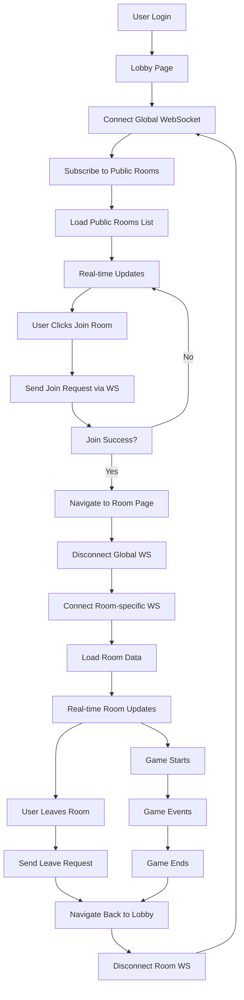

# Frontend WebSocket Connection Guide

## 🎯 Tổng Quan

Hướng dẫn này giúp Frontend kết nối WebSocket đúng cách để tránh lag backend và đảm bảo real-time updates hoạt động mượt mà.

## 🚨 Vấn Đề Hiện Tại

Từ log backend, có thể thấy:
```
2025/08/28 14:48:48 Closing existing global connection for user 3
2025/08/28 14:48:48 Added global connection for user 3
2025/08/28 14:48:52 Closing existing global connection for user 3
2025/08/28 14:48:52 Added global connection for user 3
```

**Vấn đề**: Frontend đang tạo WebSocket connections liên tục, gây lag backend.

## 🔧 Giải Pháp Backend Đã Implement

### 1. Rate Limiting
- **Giới hạn**: 1 connection per 2 seconds per user
- **Response**: HTTP 429 (Too Many Requests) nếu vượt quá
- **Message**: "Too many connection attempts. Please wait before reconnecting."

### 2. Connection Deduplication
- Tự động đóng connection cũ khi có connection mới
- Graceful close với message "Replaced by new connection"

### 3. Reduced Logging
- Ping/pong logs chỉ hiển thị mỗi 3 phút
- Giảm spam log để tăng performance

---

## 📱 Frontend Implementation Guide

### 1. WebSocket Manager Class

```javascript
class PKWebSocketManager {
  constructor() {
    this.socket = null;
    this.isConnected = false;
    this.reconnectAttempts = 0;
    this.maxReconnectAttempts = 3;
    this.reconnectDelay = 2000; // 2 seconds
    this.currentRoomId = null;
    this.isGlobalConnection = false;
    this.eventListeners = new Map();
  }

  // Kết nối WebSocket với rate limiting protection
  async connect(token, roomId = null) {
    // Đóng connection cũ nếu có
    this.disconnect();

    // Rate limiting: đợi ít nhất 2 giây giữa các lần connect
    if (this.lastConnectTime) {
      const timeSinceLastConnect = Date.now() - this.lastConnectTime;
      if (timeSinceLastConnect < 2000) {
        const waitTime = 2000 - timeSinceLastConnect;
        console.log(`Rate limiting: waiting ${waitTime}ms before reconnecting`);
        await new Promise(resolve => setTimeout(resolve, waitTime));
      }
    }

    this.lastConnectTime = Date.now();
    
    const baseUrl = 'ws://localhost:8080/api/v1/protected/pk/ws';
    const url = roomId ? `${baseUrl}?room_id=${roomId}` : baseUrl;
    
    try {
      this.socket = new WebSocket(url);
      this.currentRoomId = roomId;
      this.isGlobalConnection = !roomId;
      
      this.setupEventHandlers();
      
      // Đợi connection established
      await this.waitForConnection();
      
      console.log(`✅ WebSocket connected successfully - ${roomId ? 'Room' : 'Global'} mode`);
      return true;
    } catch (error) {
      console.error('❌ WebSocket connection failed:', error);
      this.handleReconnect(token, roomId);
      return false;
    }
  }

  // Thiết lập event handlers
  setupEventHandlers() {
    this.socket.onopen = () => {
      console.log('🔗 WebSocket connection opened');
      this.isConnected = true;
      this.reconnectAttempts = 0;
      
      // Subscribe to public room events nếu là global connection
      if (this.isGlobalConnection) {
        this.subscribeToPublicRooms();
      }
    };

    this.socket.onmessage = (event) => {
      const message = JSON.parse(event.data);
      this.handleMessage(message);
    };

    this.socket.onclose = (event) => {
      console.log('🔌 WebSocket connection closed:', event.code, event.reason);
      this.isConnected = false;
      
      // Chỉ reconnect nếu không phải là manual disconnect
      if (event.code !== 1000) {
        this.handleReconnect();
      }
    };

    this.socket.onerror = (error) => {
      console.error('❌ WebSocket error:', error);
    };
  }

  // Đợi connection established
  waitForConnection() {
    return new Promise((resolve, reject) => {
      const timeout = setTimeout(() => {
        reject(new Error('Connection timeout'));
      }, 5000);

      if (this.socket.readyState === WebSocket.OPEN) {
        clearTimeout(timeout);
        resolve();
      } else {
        this.socket.onopen = () => {
          clearTimeout(timeout);
          resolve();
        };
      }
    });
  }

  // Xử lý reconnect với exponential backoff
  async handleReconnect(token, roomId = this.currentRoomId) {
    if (this.reconnectAttempts >= this.maxReconnectAttempts) {
      console.error('❌ Max reconnection attempts reached');
      this.dispatchEvent('max_reconnect_attempts');
      return;
    }

    this.reconnectAttempts++;
    const delay = this.reconnectDelay * Math.pow(2, this.reconnectAttempts - 1);
    
    console.log(`🔄 Attempting to reconnect (${this.reconnectAttempts}/${this.maxReconnectAttempts}) in ${delay}ms`);
    
    setTimeout(async () => {
      await this.connect(token, roomId);
    }, delay);
  }

  // Đóng connection
  disconnect() {
    if (this.socket) {
      this.socket.close(1000, 'Manual disconnect');
      this.socket = null;
      this.isConnected = false;
      this.currentRoomId = null;
      this.isGlobalConnection = false;
    }
  }

  // Gửi message
  send(message) {
    if (this.isConnected && this.socket) {
      this.socket.send(JSON.stringify(message));
    } else {
      console.error('❌ WebSocket not connected');
    }
  }

  // Event handling
  handleMessage(message) {
    console.log('📨 Received message:', message.type);
    
    // Dispatch event cho UI
    this.dispatchEvent(message.type, message.data);
    
    // Handle specific message types
    switch (message.type) {
      case 'public_room_created':
        this.handlePublicRoomCreated(message.data);
        break;
      case 'public_room_updated':
        this.handlePublicRoomUpdated(message.data);
        break;
      case 'public_room_removed':
        this.handlePublicRoomRemoved(message.data);
        break;
      case 'room_update':
        this.handleRoomUpdate(message.data);
        break;
      case 'player_joined':
        this.handlePlayerJoined(message.data);
        break;
      case 'player_left':
        this.handlePlayerLeft(message.data);
        break;
      case 'game_start':
        this.handleGameStart(message.data);
        break;
      case 'challenge_submission':
        this.handleChallengeSubmission(message.data);
        break;
      case 'score_update':
        this.handleScoreUpdate(message.data);
        break;
      default:
        console.log('Unknown message type:', message.type);
    }
  }

  // Event system
  addEventListener(event, callback) {
    if (!this.eventListeners.has(event)) {
      this.eventListeners.set(event, []);
    }
    this.eventListeners.get(event).push(callback);
  }

  removeEventListener(event, callback) {
    if (this.eventListeners.has(event)) {
      const callbacks = this.eventListeners.get(event);
      const index = callbacks.indexOf(callback);
      if (index > -1) {
        callbacks.splice(index, 1);
      }
    }
  }

  dispatchEvent(event, data) {
    if (this.eventListeners.has(event)) {
      this.eventListeners.get(event).forEach(callback => {
        try {
          callback(data);
        } catch (error) {
          console.error(`Error in event handler for ${event}:`, error);
        }
      });
    }
  }

  // Public room methods
  subscribeToPublicRooms() {
    this.send({
      type: 'subscribe_public_rooms',
      data: {}
    });
  }

  getPublicRooms(page = 1, limit = 10, categoryId = null) {
    this.send({
      type: 'get_public_rooms',
      data: {
        page,
        limit,
        category_id: categoryId
      }
    });
  }

  // Room-specific methods
  setReady(isReady) {
    this.send({
      type: 'ready_status',
      data: { is_ready: isReady }
    });
  }

  startGame() {
    this.send({
      type: 'start_game',
      data: {}
    });
  }

  submitChallenge(challengeId, userInput, isCorrect, scoreEarned, timeTaken) {
    this.send({
      type: 'challenge_submission',
      data: {
        challenge_id: challengeId,
        user_input: userInput,
        is_correct: isCorrect,
        score_earned: scoreEarned,
        time_taken_seconds: timeTaken
      }
    });
  }

  // Event handlers
  handlePublicRoomCreated(data) {
    console.log('🏠 Public room created:', data.room);
    this.dispatchEvent('public_room_created', data.room);
  }

  handlePublicRoomUpdated(data) {
    console.log('🔄 Public room updated:', data.room);
    this.dispatchEvent('public_room_updated', data.room);
  }

  handlePublicRoomRemoved(data) {
    console.log('🗑️ Public room removed:', data.room_id);
    this.dispatchEvent('public_room_removed', data);
  }

  handleRoomUpdate(data) {
    console.log('🔄 Room updated:', data.room);
    this.dispatchEvent('room_update', data.room);
  }

  handlePlayerJoined(data) {
    console.log('👋 Player joined:', data.participant);
    this.dispatchEvent('player_joined', data.participant);
  }

  handlePlayerLeft(data) {
    console.log('👋 Player left:', data.user_id);
    this.dispatchEvent('player_left', data);
  }

  handleGameStart(data) {
    console.log('🎮 Game started:', data);
    this.dispatchEvent('game_start', data);
  }

  handleChallengeSubmission(data) {
    console.log('📝 Challenge submitted:', data);
    this.dispatchEvent('challenge_submission', data);
  }

  handleScoreUpdate(data) {
    console.log('📊 Score updated:', data);
    this.dispatchEvent('score_update', data);
  }
}
```

### 2. Navigation Flow Implementation

#### A. Lobby Page (Public Rooms List)

```javascript
// lobby.js
class LobbyPage {
  constructor() {
    this.wsManager = new PKWebSocketManager();
    this.rooms = [];
    this.currentPage = 1;
    this.isLoading = false;
  }

  async initialize(token) {
    console.log('🚀 Initializing lobby page...');
    
    // Kết nối WebSocket cho public room events
    await this.wsManager.connect(token);
    
    // Load initial room list
    this.loadPublicRooms();
    
    // Setup event listeners
    this.setupEventListeners();
  }

  setupEventListeners() {
    // Listen for WebSocket events
    this.wsManager.addEventListener('public_room_created', (room) => {
      this.addRoomToList(room);
    });

    this.wsManager.addEventListener('public_room_updated', (room) => {
      this.updateRoomInList(room);
    });

    this.wsManager.addEventListener('public_room_removed', (data) => {
      this.removeRoomFromList(data.room_id);
    });

    this.wsManager.addEventListener('rooms_loaded', (data) => {
      this.renderRoomList(data.rooms);
    });

    // Listen for page navigation
    window.addEventListener('beforeunload', () => {
      this.cleanup();
    });
  }

  loadPublicRooms(page = 1, limit = 10) {
    this.isLoading = true;
    this.updateLoadingUI();
    
    this.wsManager.getPublicRooms(page, limit);
  }

  renderRoomList(rooms) {
    this.rooms = rooms;
    this.isLoading = false;
    this.updateLoadingUI();
    
    const roomListElement = document.getElementById('room-list');
    roomListElement.innerHTML = '';
    
    rooms.forEach(room => {
      const roomElement = this.createRoomElement(room);
      roomListElement.appendChild(roomElement);
    });
  }

  addRoomToList(room) {
    this.rooms.unshift(room);
    const roomListElement = document.getElementById('room-list');
    const roomElement = this.createRoomElement(room);
    roomListElement.insertBefore(roomElement, roomListElement.firstChild);
  }

  updateRoomInList(room) {
    const index = this.rooms.findIndex(r => r.id === room.id);
    if (index !== -1) {
      this.rooms[index] = room;
      const roomElement = document.getElementById(`room-${room.id}`);
      if (roomElement) {
        roomElement.replaceWith(this.createRoomElement(room));
      }
    }
  }

  removeRoomFromList(roomId) {
    this.rooms = this.rooms.filter(room => room.id !== roomId);
    const roomElement = document.getElementById(`room-${roomId}`);
    if (roomElement) {
      roomElement.remove();
    }
  }

  createRoomElement(room) {
    const element = document.createElement('div');
    element.className = 'room-card';
    element.id = `room-${room.id}`;
    element.innerHTML = `
      <h3>${room.room_name}</h3>
      <p>Code: ${room.room_code}</p>
      <p>Players: ${room.current_players}/${room.max_players}</p>
      <p>Status: ${room.room_status}</p>
      <button onclick="lobbyPage.joinRoom('${room.room_code}')">Join</button>
    `;
    return element;
  }

  async joinRoom(roomCode) {
    console.log('🎯 Joining room:', roomCode);
    
    try {
      // Gửi join request qua WebSocket
      this.wsManager.send({
        type: 'join_room',
        data: {
          room_code: roomCode,
          password: '' // Nếu có password
        }
      });

      // Listen for join response
      this.wsManager.addEventListener('join_room_response', (data) => {
        if (data.success) {
          console.log('✅ Successfully joined room:', data.room);
          // Navigate to room page
          this.navigateToRoom(data.room.id);
        } else {
          console.error('❌ Failed to join room:', data.error);
          alert('Failed to join room: ' + data.error);
        }
      });
    } catch (error) {
      console.error('❌ Error joining room:', error);
      alert('Error joining room: ' + error.message);
    }
  }

  navigateToRoom(roomId) {
    console.log('🔄 Navigating to room:', roomId);
    
    // Lưu room ID vào session storage
    sessionStorage.setItem('currentRoomId', roomId);
    
    // Navigate to room page
    window.location.href = `/room/${roomId}`;
  }

  updateLoadingUI() {
    const loadingElement = document.getElementById('loading');
    if (this.isLoading) {
      loadingElement.style.display = 'block';
    } else {
      loadingElement.style.display = 'none';
    }
  }

  cleanup() {
    console.log('🧹 Cleaning up lobby page...');
    // WebSocket sẽ được đóng khi navigate
    // Không cần disconnect ở đây vì sẽ reconnect ở room page
  }
}

// Initialize lobby page
const lobbyPage = new LobbyPage();
document.addEventListener('DOMContentLoaded', async () => {
  const token = localStorage.getItem('jwt_token');
  if (token) {
    await lobbyPage.initialize(token);
  } else {
    window.location.href = '/login';
  }
});
```

#### B. Room Page (Game Room)

```javascript
// room.js
class RoomPage {
  constructor() {
    this.wsManager = new PKWebSocketManager();
    this.room = null;
    this.currentUser = null;
    this.gameState = 'waiting'; // waiting, playing, finished
  }

  async initialize(token, roomId) {
    console.log('🚀 Initializing room page for room:', roomId);
    
    // Kết nối WebSocket cho room-specific events
    await this.wsManager.connect(token, roomId);
    
    // Setup event listeners
    this.setupEventListeners();
    
    // Load room data
    this.loadRoomData();
  }

  setupEventListeners() {
    // Listen for WebSocket events
    this.wsManager.addEventListener('room_update', (room) => {
      this.updateRoomState(room);
    });

    this.wsManager.addEventListener('player_joined', (participant) => {
      this.addPlayerToRoom(participant);
    });

    this.wsManager.addEventListener('player_left', (data) => {
      this.removePlayerFromRoom(data.user_id);
    });

    this.wsManager.addEventListener('game_start', (data) => {
      this.startGame(data);
    });

    this.wsManager.addEventListener('challenge_submission', (data) => {
      this.showChallengeResult(data);
    });

    this.wsManager.addEventListener('score_update', (data) => {
      this.updateScoreboard(data.participants);
    });

    // Listen for page navigation
    window.addEventListener('beforeunload', () => {
      this.cleanup();
    });
  }

  loadRoomData() {
    // Room data sẽ được load qua WebSocket events
    console.log('📊 Loading room data...');
  }

  updateRoomState(room) {
    this.room = room;
    this.renderRoomInfo();
    this.renderParticipants();
    this.updateGameControls();
  }

  renderRoomInfo() {
    if (!this.room) return;
    
    document.getElementById('room-name').textContent = this.room.room_name;
    document.getElementById('room-code').textContent = this.room.room_code;
    document.getElementById('room-status').textContent = this.room.room_status;
    document.getElementById('player-count').textContent = 
      `${this.room.current_players}/${this.room.max_players}`;
  }

  renderParticipants() {
    if (!this.room) return;
    
    const participantsList = document.getElementById('participants-list');
    participantsList.innerHTML = '';
    
    this.room.participants.forEach(participant => {
      const participantElement = this.createParticipantElement(participant);
      participantsList.appendChild(participantElement);
    });
  }

  createParticipantElement(participant) {
    const element = document.createElement('div');
    element.className = 'participant-card';
    element.id = `participant-${participant.user_id}`;
    
    const readyStatus = participant.is_ready ? '✅' : '⏳';
    const hostBadge = participant.is_host ? '👑' : '';
    const connectedStatus = participant.is_connected ? '🟢' : '🔴';
    
    element.innerHTML = `
      <div class="participant-info">
        <span class="name">${participant.user.full_name}</span>
        <span class="status">${readyStatus} ${hostBadge} ${connectedStatus}</span>
      </div>
      <div class="score">Score: ${participant.current_score}</div>
    `;
    
    return element;
  }

  addPlayerToRoom(participant) {
    console.log('👋 Player joined:', participant);
    
    const participantsList = document.getElementById('participants-list');
    const participantElement = this.createParticipantElement(participant);
    participantsList.appendChild(participantElement);
    
    // Update room state
    if (this.room) {
      this.room.participants.push(participant);
      this.room.current_players++;
      this.renderRoomInfo();
    }
  }

  removePlayerFromRoom(userId) {
    console.log('👋 Player left:', userId);
    
    const participantElement = document.getElementById(`participant-${userId}`);
    if (participantElement) {
      participantElement.remove();
    }
    
    // Update room state
    if (this.room) {
      this.room.participants = this.room.participants.filter(p => p.user_id !== userId);
      this.room.current_players--;
      this.renderRoomInfo();
    }
  }

  updateGameControls() {
    if (!this.room) return;
    
    const currentUser = this.getCurrentUser();
    if (!currentUser) return;
    
    const readyButton = document.getElementById('ready-button');
    const startButton = document.getElementById('start-button');
    const leaveButton = document.getElementById('leave-button');
    
    // Ready button
    if (readyButton) {
      readyButton.onclick = () => this.setReady(!currentUser.is_ready);
      readyButton.textContent = currentUser.is_ready ? 'Not Ready' : 'Ready';
      readyButton.className = currentUser.is_ready ? 'btn btn-warning' : 'btn btn-success';
    }
    
    // Start button (only for host)
    if (startButton) {
      const canStart = currentUser.is_host && this.canStartGame();
      startButton.disabled = !canStart;
      startButton.onclick = () => this.startGame();
    }
    
    // Leave button
    if (leaveButton) {
      leaveButton.onclick = () => this.leaveRoom();
    }
  }

  getCurrentUser() {
    if (!this.room) return null;
    
    const userId = parseInt(localStorage.getItem('user_id'));
    return this.room.participants.find(p => p.user_id === userId);
  }

  canStartGame() {
    if (!this.room) return false;
    
    return this.room.participants.length >= 2 && 
           this.room.participants.every(p => p.is_ready);
  }

  setReady(isReady) {
    console.log('🎯 Setting ready status:', isReady);
    this.wsManager.setReady(isReady);
  }

  startGame() {
    console.log('🎮 Starting game...');
    this.wsManager.startGame();
  }

  leaveRoom() {
    console.log('🚪 Leaving room...');
    
    // Gửi leave request
    this.wsManager.send({
      type: 'leave_room',
      data: {}
    });
    
    // Listen for leave response
    this.wsManager.addEventListener('leave_room_response', (data) => {
      if (data.success) {
        console.log('✅ Successfully left room');
        this.navigateToLobby();
      } else {
        console.error('❌ Failed to leave room:', data.error);
      }
    });
  }

  navigateToLobby() {
    console.log('🔄 Navigating back to lobby...');
    
    // Clear room data
    sessionStorage.removeItem('currentRoomId');
    
    // Navigate to lobby
    window.location.href = '/lobby';
  }

  startGame(data) {
    console.log('🎮 Game started:', data);
    this.gameState = 'playing';
    
    // Hide waiting UI, show game UI
    document.getElementById('waiting-ui').style.display = 'none';
    document.getElementById('game-ui').style.display = 'block';
    
    // Initialize game with challenges
    this.initializeGame(data);
  }

  initializeGame(data) {
    this.challenges = data.challenges;
    this.currentChallengeIndex = 0;
    this.startTime = new Date(data.start_time);
    
    this.showCurrentChallenge();
  }

  showCurrentChallenge() {
    if (this.currentChallengeIndex >= this.challenges.length) {
      this.finishGame();
      return;
    }
    
    const challenge = this.challenges[this.currentChallengeIndex];
    document.getElementById('challenge-content').textContent = challenge.content;
    
    // Play audio if available
    if (challenge.audio_url) {
      this.playAudio(challenge.audio_url);
    }
  }

  submitAnswer(userInput) {
    const challenge = this.challenges[this.currentChallengeIndex];
    const timeTaken = (Date.now() - this.startTime.getTime()) / 1000;
    
    // Calculate score (simplified)
    const isCorrect = userInput.toLowerCase().trim() === challenge.content.toLowerCase().trim();
    const scoreEarned = isCorrect ? 100 : 0;
    
    // Submit via WebSocket
    this.wsManager.submitChallenge(
      challenge.id,
      userInput,
      isCorrect,
      scoreEarned,
      timeTaken
    );
    
    // Move to next challenge
    this.currentChallengeIndex++;
    setTimeout(() => {
      this.showCurrentChallenge();
    }, 2000);
  }

  showChallengeResult(data) {
    console.log('📝 Challenge result:', data);
    
    const resultElement = document.getElementById('challenge-result');
    resultElement.textContent = data.is_correct ? '✅ Correct!' : '❌ Incorrect';
    resultElement.style.display = 'block';
    
    setTimeout(() => {
      resultElement.style.display = 'none';
    }, 2000);
  }

  updateScoreboard(participants) {
    console.log('📊 Scoreboard updated:', participants);
    
    participants.forEach(participant => {
      const participantElement = document.getElementById(`participant-${participant.user_id}`);
      if (participantElement) {
        const scoreElement = participantElement.querySelector('.score');
        scoreElement.textContent = `Score: ${participant.current_score}`;
      }
    });
  }

  finishGame() {
    console.log('🏁 Game finished');
    this.gameState = 'finished';
    
    // Show results
    document.getElementById('game-ui').style.display = 'none';
    document.getElementById('results-ui').style.display = 'block';
  }

  playAudio(audioUrl) {
    const audio = new Audio(audioUrl);
    audio.play().catch(error => {
      console.error('Error playing audio:', error);
    });
  }

  cleanup() {
    console.log('🧹 Cleaning up room page...');
    // WebSocket sẽ được đóng khi navigate
  }
}

// Initialize room page
const roomPage = new RoomPage();
document.addEventListener('DOMContentLoaded', async () => {
  const token = localStorage.getItem('jwt_token');
  const roomId = sessionStorage.getItem('currentRoomId');
  
  if (token && roomId) {
    await roomPage.initialize(token, parseInt(roomId));
  } else {
    window.location.href = '/lobby';
  }
});
```

### 3. Navigation Flow Diagram



### 4. Best Practices

#### ✅ Đúng Cách

```javascript
// 1. Sử dụng một WebSocket Manager duy nhất
const wsManager = new PKWebSocketManager();

// 2. Đợi connection established trước khi gửi messages
await wsManager.connect(token, roomId);

// 3. Cleanup khi navigate
window.addEventListener('beforeunload', () => {
  wsManager.disconnect();
});

// 4. Rate limiting protection
// WebSocket Manager tự động handle rate limiting

// 5. Graceful disconnect
wsManager.disconnect(); // Sends close code 1000
```

#### ❌ Sai Cách

```javascript
// 1. Tạo nhiều WebSocket connections
const ws1 = new WebSocket(url1);
const ws2 = new WebSocket(url2); // ❌ Không nên

// 2. Không đợi connection
ws.send(message); // ❌ Có thể fail

// 3. Không cleanup
// ❌ Memory leaks và zombie connections

// 4. Reconnect liên tục
setInterval(() => {
  ws.connect(); // ❌ Rate limiting sẽ block
}, 1000);

// 5. Force close
ws.close(); // ❌ Không graceful
```

### 5. Error Handling

```javascript
// Handle connection errors
wsManager.addEventListener('connection_error', (error) => {
  console.error('Connection error:', error);
  showNotification('Connection lost. Reconnecting...', 'warning');
});

// Handle rate limiting
wsManager.addEventListener('rate_limit_exceeded', () => {
  showNotification('Too many connection attempts. Please wait.', 'error');
});

// Handle max reconnection attempts
wsManager.addEventListener('max_reconnect_attempts', () => {
  showNotification('Unable to connect. Please refresh the page.', 'error');
});
```

### 6. Performance Monitoring

```javascript
// Monitor WebSocket performance
setInterval(() => {
  const stats = wsManager.getConnectionStats();
  console.log('WebSocket Stats:', stats);
  
  if (stats.performance_status === 'HIGH_LOAD') {
    console.warn('High WebSocket load detected');
  }
}, 30000); // Every 30 seconds
```

## 🎯 Kết Luận

Với implementation này:

1. **✅ Không còn lag backend** - Rate limiting và connection deduplication
2. **✅ Real-time updates** - WebSocket events cho tất cả changes
3. **✅ Smooth navigation** - Proper connection management
4. **✅ Error handling** - Graceful fallbacks và user feedback
5. **✅ Performance monitoring** - Track connection health

Frontend sẽ hoạt động mượt mà và không gây lag cho backend nữa! 🚀
